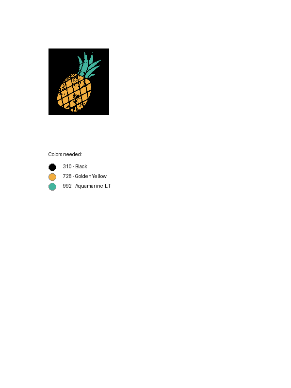

# Image simplification and dmc color processing

This is for Kayla to fetch an image and create a dmc floss color coordinated simpler version of that image for punch needle / cross stitch.

## Features

- **Image meanshift conversion**
- **DMC color conversion and guide output** 

## Table of Contents

- [Installation](#installation)
- [Features](#features)
- [Usage](#usage)
  - [File Upload](#file-upload)
  - [Quantile Selection](#quantile-selection)
  - [Processing Files](#processing-files)
- [Screenshots](#screenshots)
- [Contributing](#contributing)
- [License](#license)

## Installation

1. **Clone the Repository:**

   ```bash
   git clone https://github.com/your-username/file-upload-materialize.git
   cd file-upload-materialize

2. **Install Dependencies:**

Ensure you have Python and Django installed, then install the required dependencies:

```bash
pip install -r requirements.txt
```
Run the Django Server:
```bash
python manage.py migrate
python manage.py runserver
```

3. **Open the Application:**

Navigate to http://127.0.0.1:8000/ in your web browser to view the app.

Usage
1. File Upload
- Go to the File Upload section on the homepage.
- Click the Choose File button to select a file from your local machine.
- After selecting the file, click the Upload button to submit.
2. Quantile Selection
- In the File Processor section, you can input a decimal number between 0.00 and 1.00 to select the quantile value.
- The quantile value will affect how the file is processed.
3. Processing Files
- Once a file is uploaded, you can click the Process button next to the file to process it with the selected quantile.
- The processed files will appear in the Processed Files section.
4. DMC color process
- On the dmc process page select process for the image to convert to dmc coloring and provide a sheet with the colors

## Screenshots
### Initial image


### Mean shifted image


### DMC floss guideline page


## Contributing
We welcome contributions! If you'd like to help improve this project, feel free to submit a pull request or open an issue.

Steps to Contribute:
1. Fork the repository.
2. Create a new feature branch ```(git checkout -b feature/your-feature-name).```
3. Make your changes.
4. Commit your changes ```(git commit -m 'Add some feature')```.
5. Push to the branch ```(git push origin feature/your-feature-name)```.
6. Open a pull request.

## License
This project is licensed under the MIT License - see the LICENSE file for details.